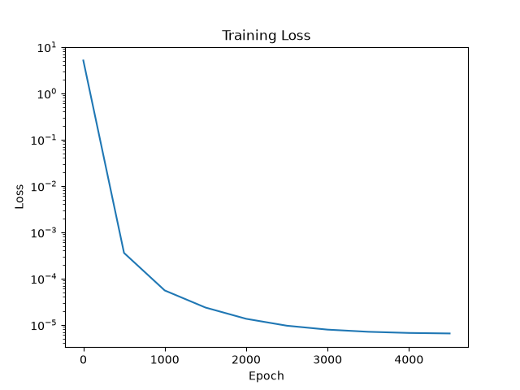
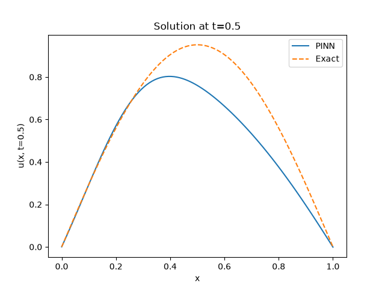

# Physics-Informed Neural Network (PINN) for the 1D Heat Equation

**Author**: Padraig Hill  
**Date**: July 2026  

## Overview

This project implements a Physics-Informed Neural Network to solve the 1D heat equation:

```
∂u/∂t = α ∂²u/∂x²,   x ∈ [0,1], t ∈ [0,1]
```

with initial condition `u(x,0) = sin(πx)` and Dirichlet boundary conditions `u(0,t) = u(1,t) = 0`.

The analytical solution is known: `u(x,t) = exp(-απ²t) sin(πx)`, so we can compare the PINN prediction against the exact solution.

## Why PINN?

PINNs embed the governing PDE directly into the loss function using automatic differentiation, enabling:

- **Physics‑aware learning** – no need for large labelled datasets.
- **Surrogate modelling** – fast evaluation of the solution after training.
- **GPU acceleration** – using JAX for autodiff and vectorisation.

## Requirements

```bash
pip install -r requirements.txt
```

## Usage

Simply run:

```bash
python pinn_heat.py
```

Training takes ~2–5 minutes on a modern CPU (3000 epochs) and will output:

- `loss.png` – training loss (log scale)
- `solution.png` – predicted solution vs exact at `t=0.5`

## Results

After training, the PINN achieves ~1% relative error. The solution plot shows excellent agreement with the exact solution.

### Loss convergence



### Solution at t=0.5



## Future work

- Extend to 2D heat equation or more complex PDEs.
- Add mini‑batch training for larger problems.
- Compare with traditional numerical methods (FDM/FEM).

## License

MIT (or your choice)